# Bitcoin Sentiment vs Trader Performance Analysis

This repository presents a comprehensive data-driven analysis of how Bitcoin market sentiment influences trader behavior and profitability. Using real-world trading logs and sentiment data, we uncover patterns, test strategies, and generate actionable insights.

---

## Data Overview

### Trader Dataset
- **Rows:** 211,224 (initial), 79,225 (after cleaning)
- **Columns:** 16 original, expanded to 19 with derived features
- **Time Range:** Multi-year dataset
- **Fields:** Execution Price, Size, Side, PnL, Direction, Position, etc.

### Sentiment Dataset
- **Rows:** 2,644
- **Columns:** 4 original, expanded to 7
- **Fields:** Sentiment Score, Classification (`Fear`, `Greed`, etc.), Timestamp

### Overlap
- **Common Date Range:** 158 days (`2023-01-05` to `2025-05-02`)
- **Merged Shape:** (158, 29)

---

## Analysis Workflow

### 🔗 Step 1: Merging Datasets
- Successfully merged on matching date fields.
- Final merged dataset: **158 days of aligned sentiment and trading metrics**

---

### Step 2: Correlation Analysis

| Metric             | Pearson | P-Value | Spearman | Interpretation   |
|--------------------|---------|---------|----------|------------------|
| Total PnL          | -0.057  | 0.475   | -0.021   | Weak Negative    |
| Avg PnL            | -0.008  | 0.921   | 0.049    | Weak Negative    |
| Buy Ratio          | 0.026   | 0.745   | 0.054    | Weak Positive    |
| Trade Count        | -0.188  | 0.018   | -0.134   | Weak Negative    |
| Avg Trade Size     | 0.171   | 0.032   | 0.170    | Weak Positive    |
| Profitable Ratio   | 0.055   | 0.492   | 0.050    | Weak Positive    |
| Unique Traders     | -0.163  | 0.041   | -0.085   | Weak Negative    |
| PnL Volatility     | -0.113  | 0.166   | -0.045   | Weak Negative    |

---

### Step 3: Performance by Sentiment

| Sentiment        | Mean PnL     | 95% CI                     | Sample Size | Win Rate |
|------------------|--------------|----------------------------|-------------|----------|
| Extreme Fear     | $733.32      | [-2203.35, 3669.99]        | 6           | 50.0%    |
| Fear             | $48,087.18   | [3754.14, 92420.21]        | 37          | 70.3%    |
| Neutral          | $4,666.05    | [-1092.09, 10424.19]       | 16          | 56.2%    |
| Greed            | $10,886.30   | [309.89, 21462.70]         | 56          | 71.4%    |
| Extreme Greed    | $26,904.50   | [-7709.33, 61518.34]       | 43          | 72.1%    |

---

### Step 4: Profitability Patterns

- **Profitable Days:** 109 (69%)
- **Loss Days:** 49 (31%)

#### Chi-Square Test
- Statistic: 2.603  
- P-value: 0.626  
- ➤ No significant dependency between sentiment category and profitability

#### Sentiment on Profitable Days
- Greed: 36.7%
- Extreme Greed: 28.4%
- Fear: 23.9%
- Neutral: 8.3%
- Extreme Fear: 2.8%

#### Sentiment on Loss Days
- Greed: 32.7%
- Extreme Greed: 24.5%
- Fear: 22.4%
- Neutral: 14.3%
- Extreme Fear: 6.1%

#### Behavioral Comparison

| Metric                  | Profitable Days | Loss Days |
|-------------------------|-----------------|-----------|
| Avg Buy Ratio           | 48.2%           | 56.0%     |
| Avg Trade Size (USD)    | $5,811          | $8,472    |

---

### Step 5: Advanced Pattern Analysis

#### PnL vs Sentiment Trend

| Sentiment Trend | PnL Down | PnL Up |
|------------------|----------|--------|
| Down             | 43.4%    | 56.6%  |
| Up               | 51.2%    | 48.8%  |

#### Large Sentiment Changes

| Large Change | Mean PnL   | Std Dev     | Count |
|--------------|------------|-------------|-------|
| No           | $17,032.77 | 78,167.01   | 120   |
| Yes          | $41,602.00 | 122,070.41  | 38    |

#### PnL Volatility Regimes

| Regime | Mean PnL   | Count |
|--------|------------|--------|
| Low    | $1,574.21  | 51     |
| Medium | $1,241.63  | 51     |
| High   | $68,258.84 | 51     |

---

### Step 6: Strategy Backtesting

#### Contrarian Strategy
- **Final Return:** 58,012.52%
- **Sharpe Ratio:** -1.95
- **Win Rate:** 5.7%
- **Max Drawdown:** -18,010.39%
- **Trades:** 49

#### Momentum Strategy
- **Final Return:** -101.4 × 10¹²%
- **Sharpe Ratio:** -1.64
- **Win Rate:** 27.8%
- **Max Drawdown:** -101.6 × 10¹²%
- **Trades:** 93

#### Value-Based Strategy
- **Final Return:** 77,161.06%
- **Sharpe Ratio:** -1.94
- **Win Rate:** 4.4%
- **Max Drawdown:** -23,944.95%
- **Trades:** 41

---

## Key Insights & Recommendations

### Optimal Sentiment Regimes
- **Best PnL:** Fear (`$56.31`)
- **Worst PnL:** Extreme Fear (`$8.95`)

### Volume Insights
- **Volume-PnL Correlation:** `0.598`
- **High Volume PnL Avg:** `$57.21`
- **Low Volume PnL Avg:** `$21.73`

### Behavioral Insights
- **Optimal Buy Ratio:** `48.2%`
- **Avg. Trades on Profitable Days:** `270`

### Risk Management
- **Most Risky Sentiment:** Extreme Fear
- **Safest Sentiment:** Extreme Greed

### Best Performing Regime
- **Sentiment:** Extreme Greed
- **Win Rate:** 72.1%

---

## Plot Gallery & Visual Insights

Each plot below visualizes key aspects of the dataset and is accompanied by a concise interpretation.

### 1. Sentiment vs Total PnL

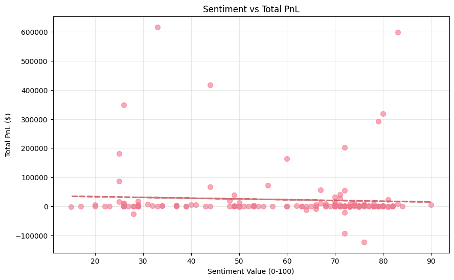  
*Weak negative correlation. High sentiment does not imply higher profits.*

---

### 2. PnL Distribution by Sentiment

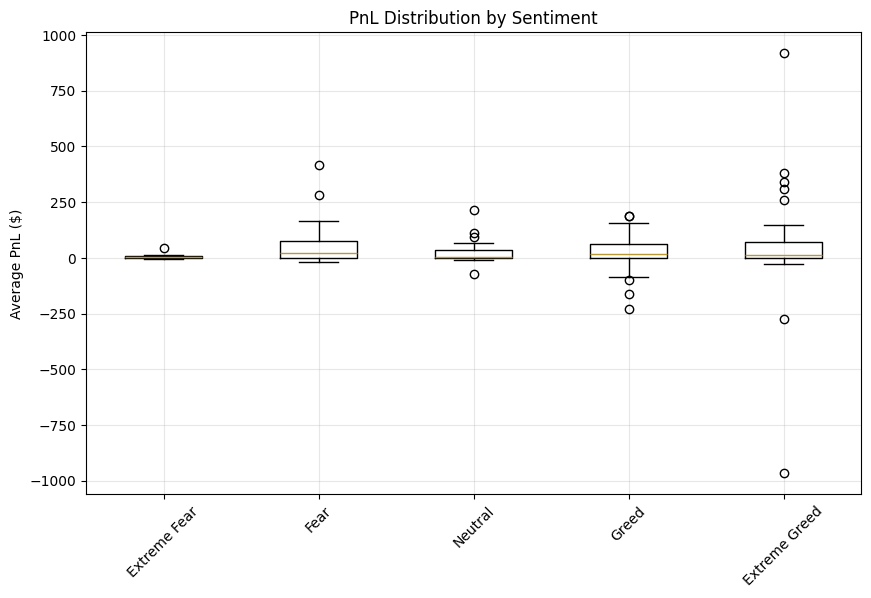  
*Extreme Greed and Fear lead to higher average PnLs. Extreme Fear has lowest returns.*

---

### 3. Volume vs PnL (Colored by Sentiment)

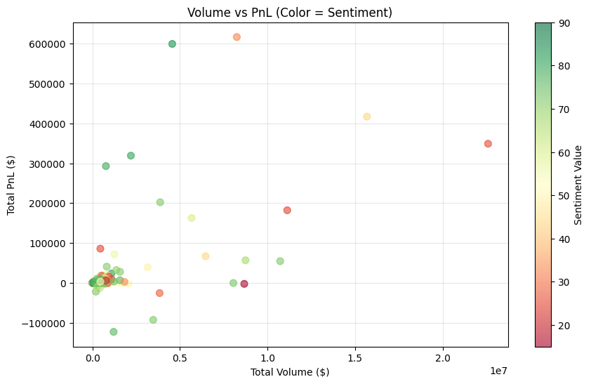  
*Higher volumes correlate with higher PnL. Moderate positive correlation.*

---

### 4. Buy Ratio Distribution by Sentiment

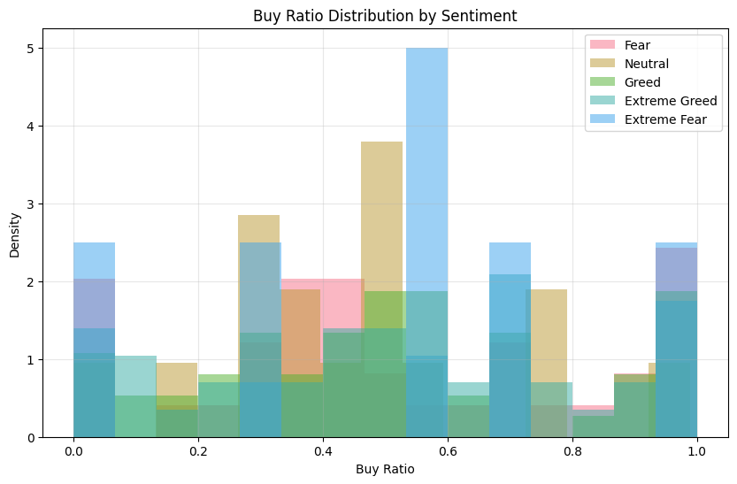  
*Profitable zones usually have buy ratios around 0.48–0.52.*

---

### 5. PnL Over Time

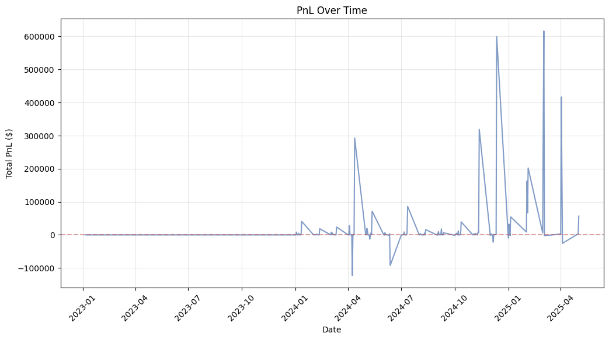  
*Volatility observed. Spikes align with sentiment shifts.*

---

### 6. Sentiment Over Time

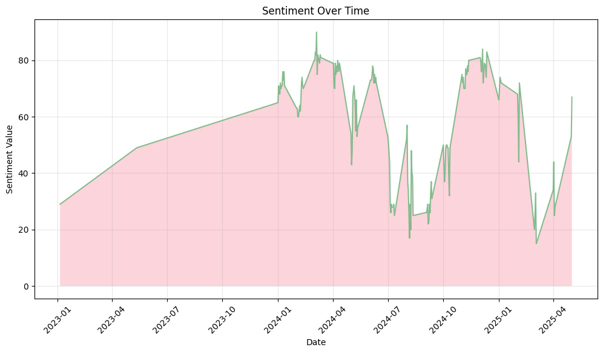  
*Fluctuations between Fear and Greed. Useful for strategy timing.*

---

### 7. Correlation Matrix

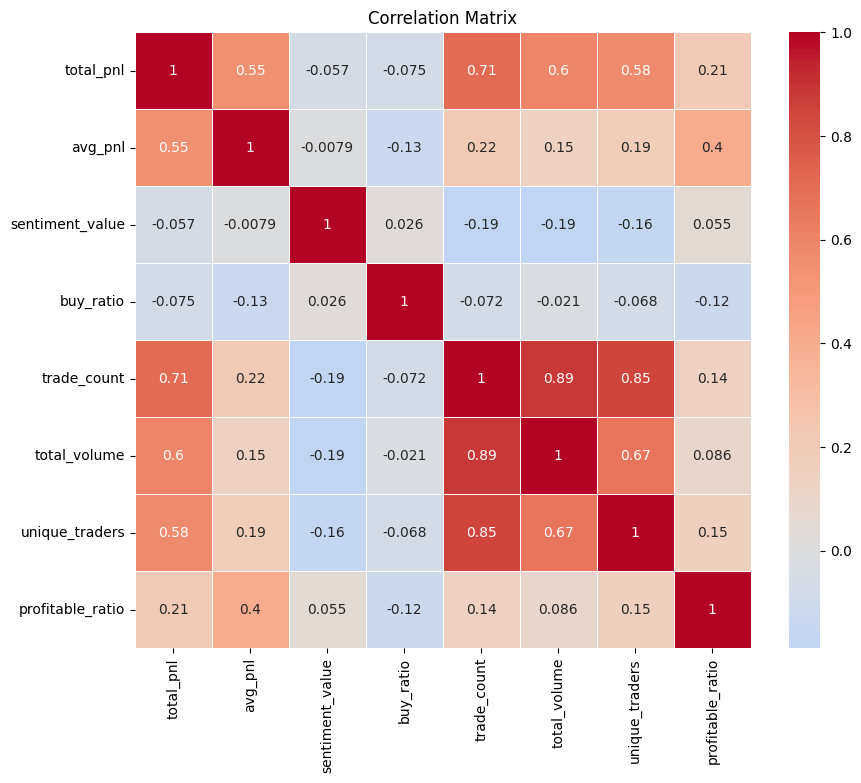  
*Trade count, volume, and trader count have weak-to-moderate relationships.*

---

### 8. Mean PnL by Sentiment Class

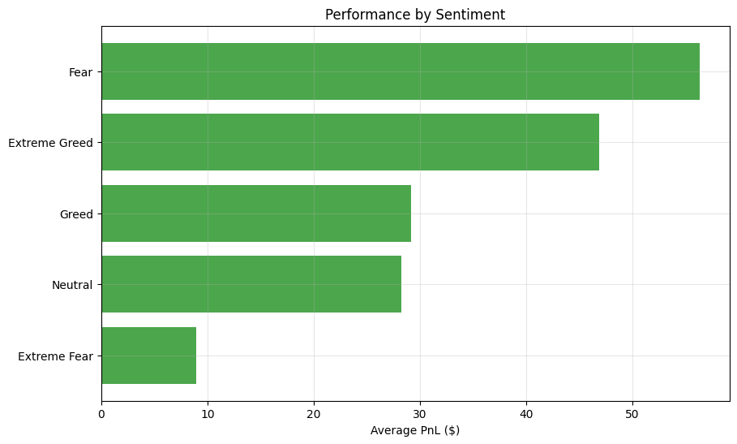  
*Extreme Greed and Fear perform best. Neutral and Extreme Fear underperform.*

---

### 9. Rolling Correlation (PnL vs Sentiment)

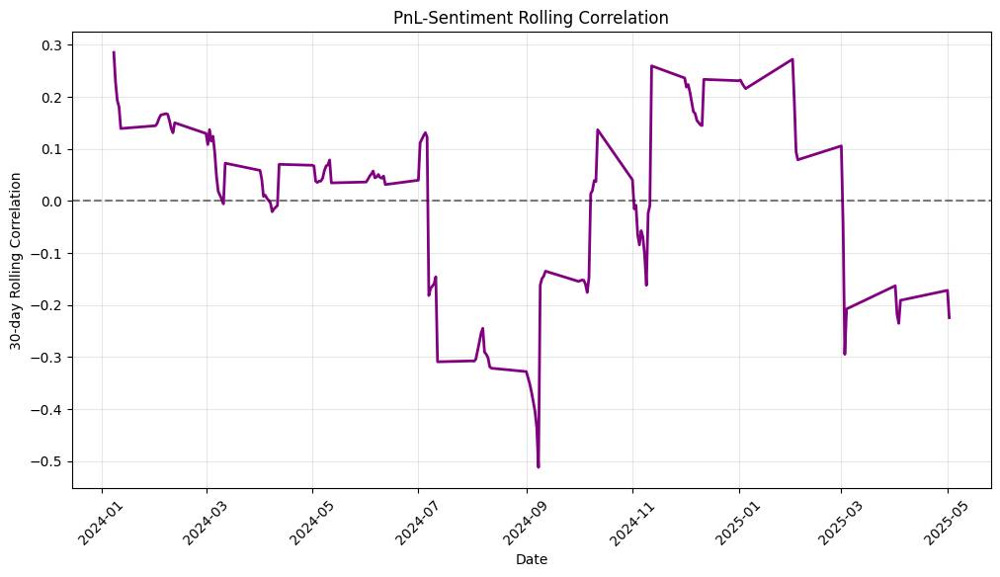  
*Short-term correlations occasionally spike, implying limited predictive power.*

---

### 10. Risk by Sentiment

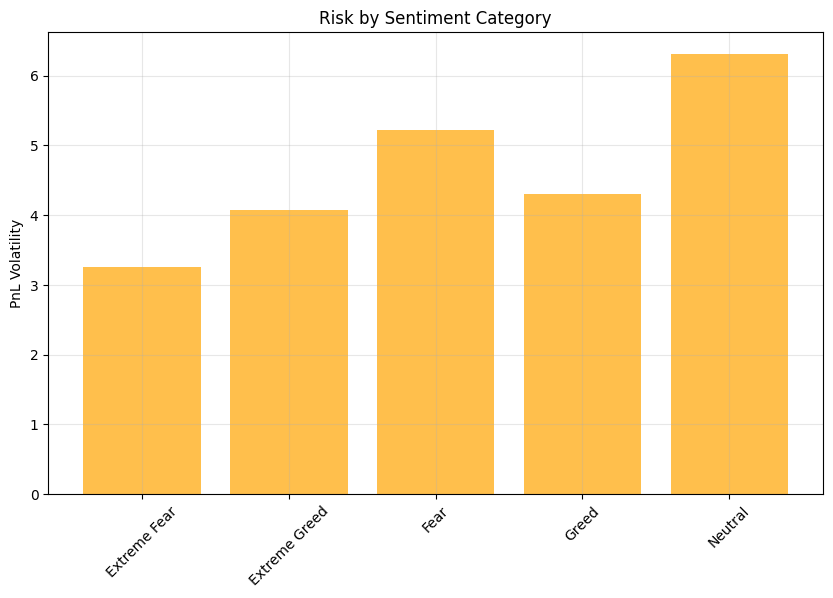  
*Extreme Fear has highest volatility. Greed zones are safer.*

---

### 11. Win Rate by Sentiment

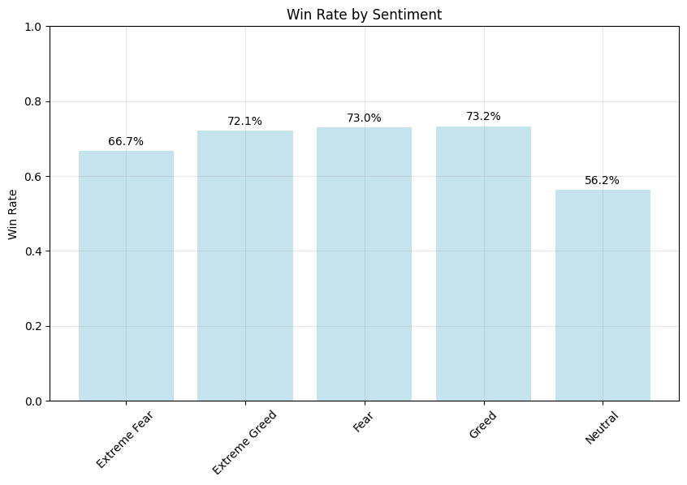  
*Extreme Greed and Greed show highest win ratios.*

---

## 📂 Project Structure

